# Domain Driven Sample in Java
- This repository is a short summary of the content from the book [Practical Domain-Driven Design in Enterprise Java (by Vijay Nair](https://www.amazon.com/Practical-Domain-Driven-Design-Enterprise-Java/dp/1484245423))

- Acronym table list:

| **Abbreviations** | **Explainations**        |
|----------------   |-----------------     |
| DDD               | Domain Driven Design |

# 1. Definition of DDD:
> Domain-Driven Design is an approach to software development that centers the development on programming a domain model that has a rich understanding of the processes and rules of a domain. The name comes from a 2003 book by Eric Evans that describes the approach through a catalog of patterns. Since then a community of practitioners have further developed the ideas, spawning various other books and training courses. The approach is particularly suited to complex domains, where a lot of often-messy logic needs to be organized.
[[1]](https://martinfowler.com/bliki/DomainDrivenDesign.htmlhttps://martinfowler.com/bliki/DomainDrivenDesign.html)

# 2. Core concepts
## 2.1 Problem Space/Business Domain
- All DDD modeling start with the defining of **problems space (or business domain)**. It identifies the main business problem that you intend to solve using DDD.
- For example, for a retail banking service company, their core problems space will be:
    - Checking account management.
    - Saving account management.
    - Credit card management.

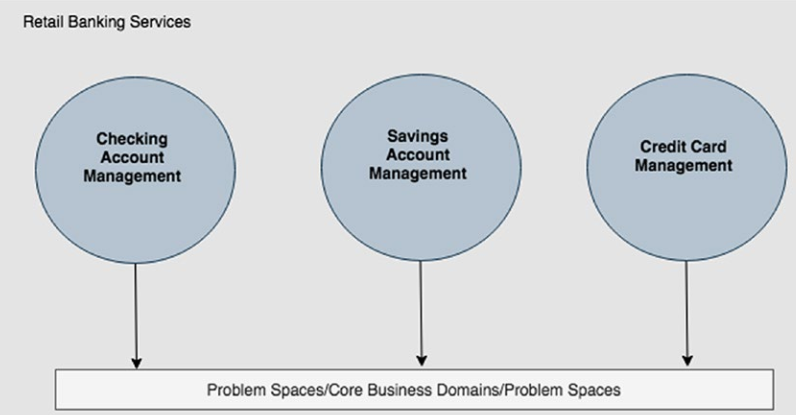

- Another example from corporate banking services, their core problems space may differ from retail banking:
    - Cash management.
    - Trade management.
    - Credit card management.
    
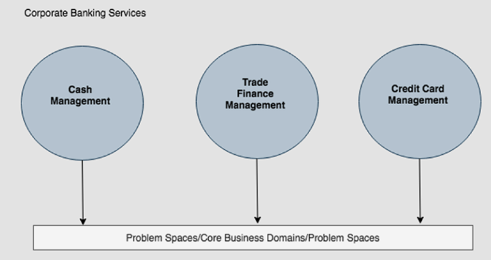

Problem spaces/business domains always invariably translate into the core business propositions that company offer.

## 2.2 Sub-Domains/Bounded Contexts.
- Once we have identified the main Business Domain, the next step is to break the domain into its sub-domains. The identification of the sub-domains essentially involves the breaking down of the various business capabilities of your main business domain into cohesive units of business functionalities.
- For example, from previous example, the **credit card management problems space** can be divided into:
    - **Products**: This sub-domain takes care of the business capability of managing all types of credit card products.
    - **Billings**: This sub-domain takes care of the business capability of billing for a customer’s credit card.
    - **Claims**: This sub-domain takes care of the business capability of managing any kinds of claims for a customer’s credit card.
    
- When we try to map from problems space to solution space, we define a **bounded context** to define our solution, for example, can we put all the sub-domain the one single bounded context (monolith architect) or each sub domain have their own bounded context (micro-services approach).

- For example, the Auto loan lease management company may have sub domain of: originations, servicing, collections, and they can be bounded co as :

| Monolith       | SOA            |
|----------------|----------------|
|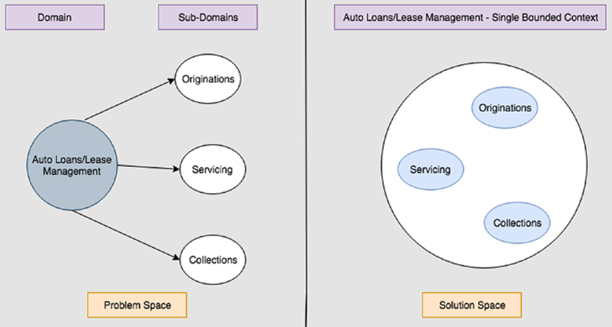 ||

- **Bounded context** from implementation view point can help us with deployment, for example with single bounded context for all sub domain, we can deploy our application a single WAR/JAR file on application server. Or multiple WAR/JAR files in multiple application server or docker container.

## 2.3 The Domain Model

In business language, this involves identifying
* Business Entities
* Business Rules
* Business Flows
* Business Operations
* Business Events

In technical language within the DDD world, this translates into identifying
* Aggregates/Entities/Value Objects
* Domain Rules
* Sagas
* Commands/Queries
* Events

**Aggregates/Entity Objects/Value Objects**

- The **Aggregate** (also known as the root aggregate) is the central business object within your Bounded Context and defines the scope of consistency within that Bounded context. Every aspect of your Bounded Context begins and ends within your root aggregate.
> Aggregate = Principal identifier of your Bounded Context
- **Entity Objects** have an identity of their own but cannot exist without the root aggregate, that is, they are created when the root aggregate is created and are destroyed when the root aggregate is destroyed.
> Entity Objects = Secondary identifiers of your Bounded Context
- **Value Objects** have no identity and are easily replaceable within an instance of a root aggregate or an entity.
- **Example**:

**Domain Rules**
- **Domain Rules** are pure business rule definitions. Modeled as Objects too, they assist the Aggregate for any kind of business logic execution within the scope of a Bounded Context.

- Within our Originations Bounded Context, a good example of a Domain Rule is a “State Applicant Compliance Validation” Business Rule. The rule basically states that depending upon the “state” of the Loan Application (e.g., CA, NY), additional validation checks could be applicable to the loan applicant.

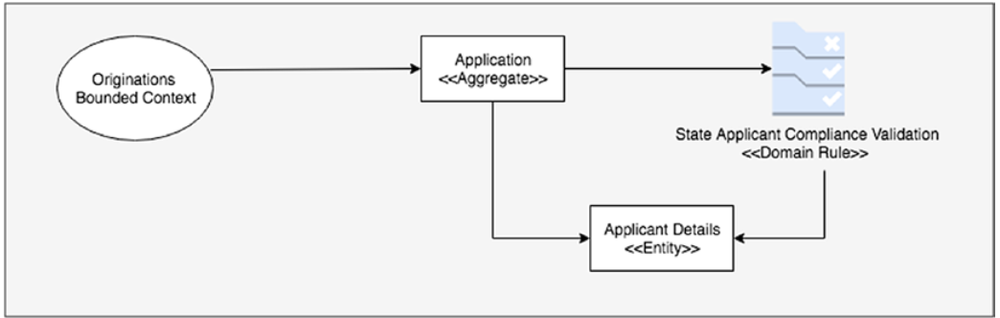

**Commands/Queries**
-  Commands and Queries represent any kind of operations within the Bounded Context which either affect the state of the aggregate/entity or query the state of the aggregate/ entity.

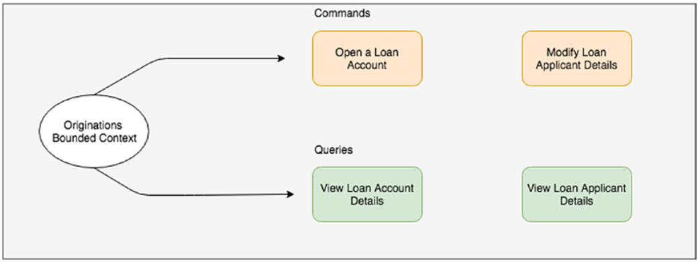

**Events**
- Events capture any kind of state change either with an aggregate or an entity within the Bounded Context.

**Sagas**
- The final aspect of the DDD model is to flush out any kind of business processes/ workflows within your Business Domain. In the DDD terminology, these are termed as sagas. 
- **Example**:

# 3. Main project overview (Cargo Tracker)
## Cargo Tracker: Sub-Domains/Bounded Contexts:

- **Booking**:  
    - Booking cargos
    - Assign routes to cargos
    - Modify cargos
    - Cancel cargos
- **Routing**:
    - Optimize itinerary allocation for cargos based on their Route Specification
    - Voyage Maintenance for the carriers that will carry cargos (e.g., addition of new routes)
- **Handling**:
    - As the cargo progresses along its assigned route, it will need to be inspected/handled at the various ports of transit. This area covers all operations related to the Handling activity of cargos.
- **Tracking** – Customers need comprehensive, detailed, and up-to date information of their booked cargos. The Tracking business area provides this capability.

With the defined bounded context, we can structure our project as a monolith with multiple modules and central database or micro service with distributed database for each services.

| Monolith       | SOA            |
|----------------|----------------|
| | 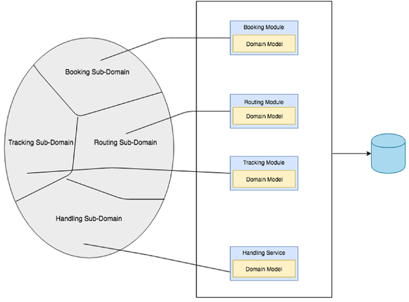|

## Cargo Tracker: Domain Model  

Domain model includes:
- **Core domain model**: aggregates, id of aggregates, entities and objects values.
- **Domain model operations**: Commands, Queries, and Events.

### Aggregates:
- **Aggregates** comprises of root entities, sub entities and value objects. Aggregates exist as a single unit that any operation updates the state of the aggregate as a whole. **Aggregates** are responsible for
capturing all State and Business Rules associated with the Bounded Context.

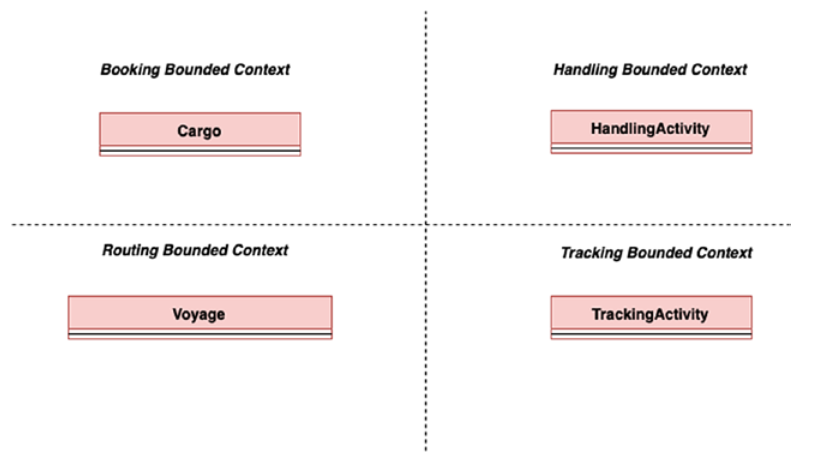

- **Aggregates id**: Each Aggregate needs to be uniquely identified using an Aggregate Identifier. The
Aggregate Identifier is implemented using a Business key. 

### Entities:
- **Entities** in bounded context have their own id and schema, but can not exist alone without aggregates ,**For example**, each cargo will have a destination **location**, the location itself is a entities but it can not exist without cargo aggregates.

### Value objects:
- **Values Objects** is a stateless have no identity of their own and are replaceable in any instance of an aggregate.
- For example, the **Cargo Aggregate** has the following Value Objects:
    - **Booking** Amount of the cargo.
    - **Route** specification (Origin Location, Destination Location, Destination Arrival Deadline).
    - **Itinerary** that the cargo is assigned to based on the Route Specification. The Itinerary consists of multiple **Legs** that the cargo might be routed through to get to the destination....
    - **Delivery Progress** of the cargo against its Route Specification and Itinerary assigned to it. The Delivery Progress provides details on the Routing Status, Transport Status, Current Voyage of the cargo, Last Known Location of the cargo, Next Expected Activity, and the Last Activity that occurred on the cargo.
- **Work Flow** starting when a new cargo is booked:
    1. New **Route** is assigned, new **empty itinerary** is created, **delivery process** is zero.
    2. New **Itinerary** assigned.
    3. As the cargo progresses through multiple ports as part of its itinerary, the **Delivery** progress is updated and replaced within the Cargo Aggregate.
    4. Finally, if the customer chooses to change the delivery location of the cargo or the deadline for delivery, the **Route Specification** changes, a new Cargo **Itinerary** will be assigned, the **Delivery** is recalculated, and the **Booking Amount changes**.

### Cargo Tracker: Domain Model Operations:
Operations within a Bounded Context might be:
- Commands that request a change of state within the Bounded Context
- Queries that request the state of the Bounded Context
- Events that notify the state change of the Bounded Context

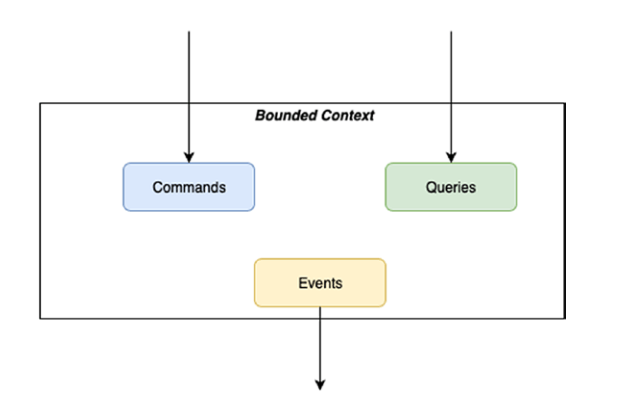

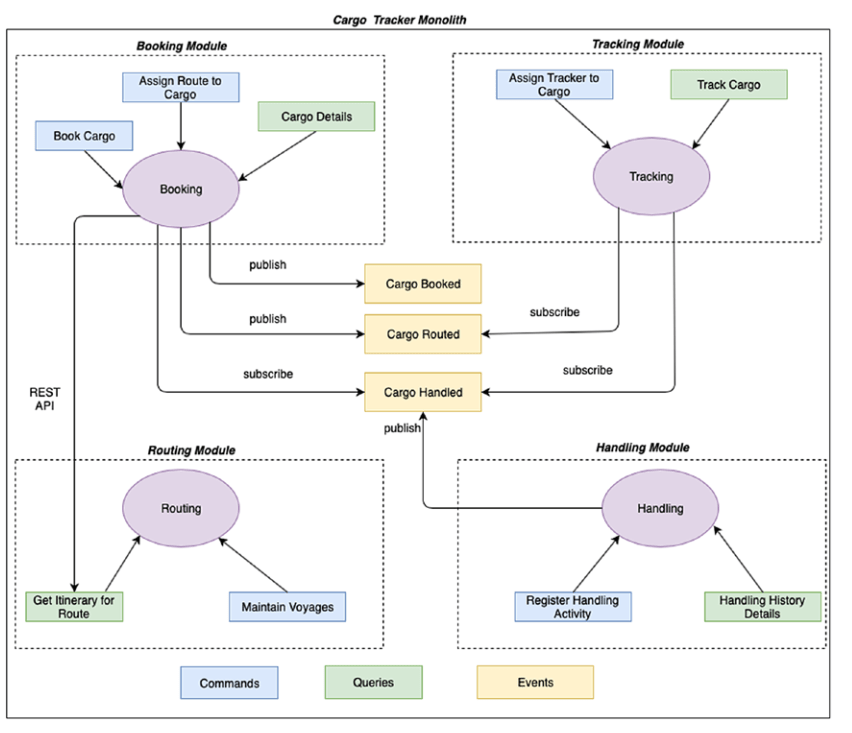

### Sagas:
* Sagas are used primarily when we adopt the microservices architectural style for developing our applications. 
* The distributed nature of microservices application requires us to implement a mechanism to maintain data consistency for use cases that may span across multiple microservices. 
* Sagas help us implement that. Sagas can be implemented in two ways either via **Event Choreography** or via **Event Orchestration**. **Event choreography** use a sequence of events while **event orchestration** use a central component.

| Event orchestration               | Event choreography  |
|--------------------               |---------------------|
| 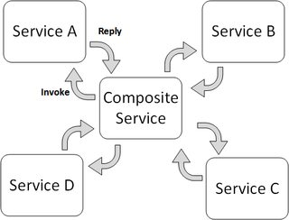     |       |

### Domain Model Services:
There are three types of Domain Model Services for any Bounded Context:
- Inbound Services where we implement well-defined interfaces which enable external parties to interact with the Domain Model
- Outbound Services where we implement all interactions with External Repositories/other Bounded Contexts
- Application Services which act as the façade layer between the Domain Model and both Inbound and Outbound services.

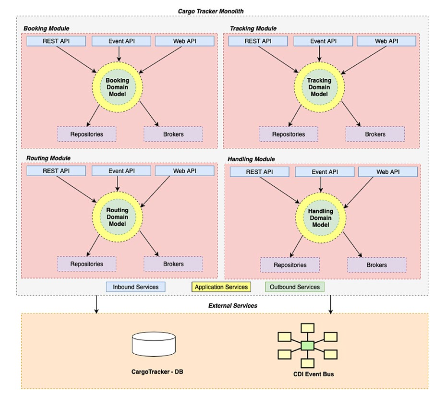

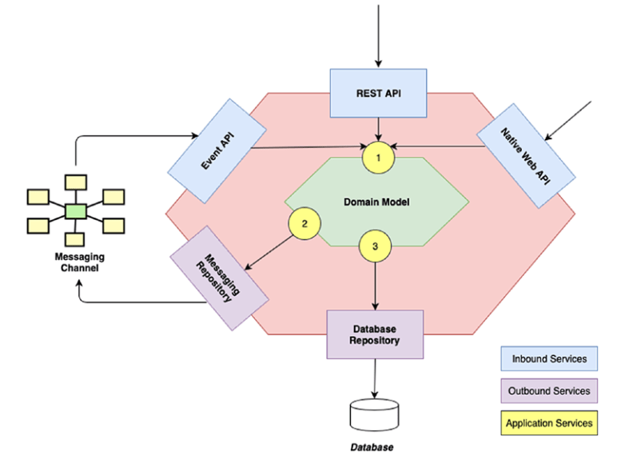