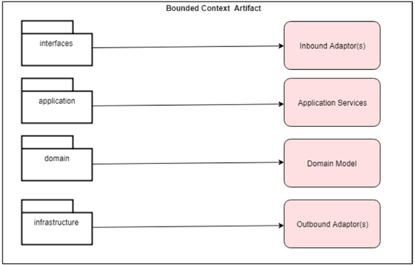
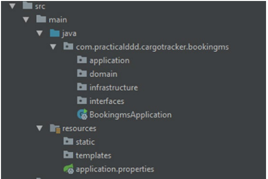
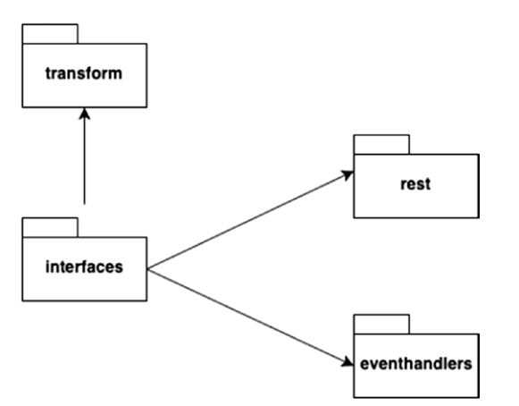
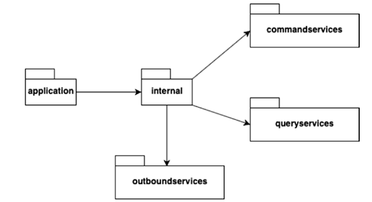
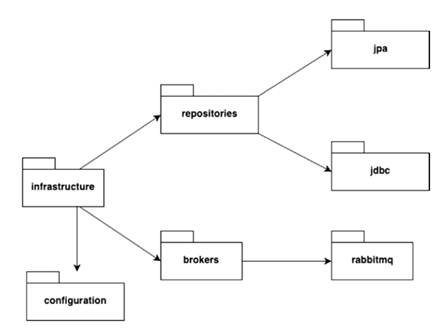
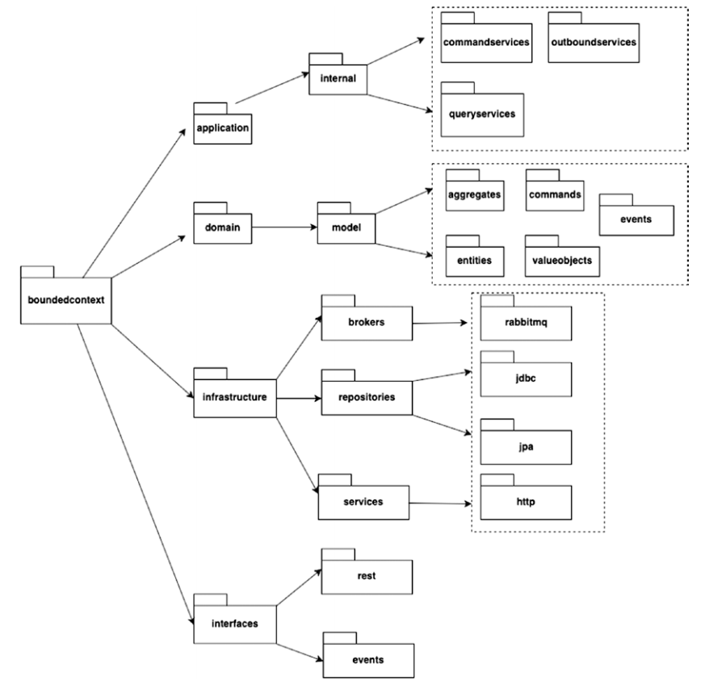

## DDD in Spring

- Our implementation will use:
    1. spring-boot-starter-web
    2. spring-boot-starter-data-jpa
    3. spring-cloud-starter-stream-rabbit

```xml
<dependencies>
	<dependency>
		<groupId>org.springframework.boot</groupId>
		<artifactId>spring-boot-starter-data-jpa</artifactId>
	</dependency>
	<dependency>
		<groupId>org.springframework.boot</groupId>
		<artifactId>spring-boot-starter-web</artifactId>
	</dependency>
	<dependency>
		<groupId>org.springframework.cloud</groupId>
		<artifactId>spring-cloud-starter-stream-rabbit</artifactId>
	</dependency>
	
	<!-- Test-->
	<dependency>
		<groupId>org.springframework.boot</groupId>
		<artifactId>spring-boot-starter-test</artifactId>
		<scope>test</scope>
	</dependency>
	<dependency>
		<groupId>org.springframework.cloud</groupId>
		<artifactId>spring-cloud-stream-test-support</artifactId>
		<scope>test</scope>
	</dependency>
	
	<!-- DB connection-->
	<dependency>
		<groupId>mysql</groupId>
		<artifactId>mysql-connector-java</artifactId>
	</dependency>
</dependencies>
```

### Project structure:





#### interfaces:

- This package encapsulate all inbound interfaces to our context classified on communication protocols. The main purpose
  of **interfaces** package is to communicate on behalf of domain model (eg HTTP Rest API, web socket, FTP, ...)
- As an example, the Booking Bounded Context provides REST APIs for sending State Change Requests, that is, Commands, to
  it (e.g., Book Cargo Command, Assign Route to Cargo Command). Similarly, the Booking Bounded Context provides REST
  APIs for sending State Retrieval Requests, that is, Queries, to it (e.g., Retrieve Cargo Booking Details, List all
  Cargos). This is grouped into the “rest” package.
- It also has Event Handlers which subscribe to the various Events that are generated by other Bounded Contexts. All
  Event Handlers are grouped into the “eventhandlers” package. In addition to these two packages, the interface package
  also contains the “transform” package. This is used to translate the incoming API Resource/Event data to the
  corresponding Command/Query model required by the Domain Model.



### application:

- Application services act as the facade for the Bounded Context’s Domain Model, they are responsible for dispatching
  command & querys to underlying models.

- Summarize, application services:
    - Participate in Command and Query Dispatching
    - Invoke infrastructural components where necessary as part of the Command/Query processing
    - Provide Centralized concerns (e.g., Logging, Security, Metrics) for the underlying Domain Model
    - Make callouts to other Bounded Contexts



### domain:

- This package contains the Bounded Context’s Domain Model. This is the heart of the Bounded Context’s Domain Model
  which contains the implementation of the core Business Logic.

- The core classes of our Bounded Contexts are as follows:
    - Aggregates
    - Entities
    - Values objects
    - Commands
    - Events


### infrastructure:

- The infrastructure package serves three main purposes:
    1. When a **Bounded Context** receives an operation related to its state (**Change of State, Retrieval of State**),
       it needs an underlying repository to process the operation; infrastructure act as DAO layer change the record in
       DB related operation.

    2. When a state change, the bounded context need to **publish** events to others, the infrastructure also
       responsible for emits events to message queue.

    3. Configuration for above operation.



### summary of all layers:

